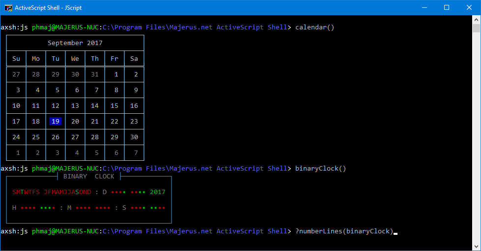

# AXSH.Library
Scripts, Functions, Modules and Script Components library for Majerus.net ActiveScript Shell (axsh)

ActiveScript Shell (axsh) is a Windows 10 command line shell using Active Scripting Engines. This repository is used to store extra or under development scripts, dynamically-loaded functions and modules, as well as Windows Script Components designed to extend AXSH.

These can be added to your environment simply by placing them in a %UserProfile%\Documents\Majerus.net ActiveScript Shell\ folder.
For example, Functions\ files should end up in C:\Users\Username\Documents\Majerus.net ActiveScript Shell\Functions\.

ActiveScript Shell can be downloaded from http://www.majerus.net/axsh/.
Version 2.0.8.0 or later is required for dynamic loading of functions to be available.

- Philippe Majerus
