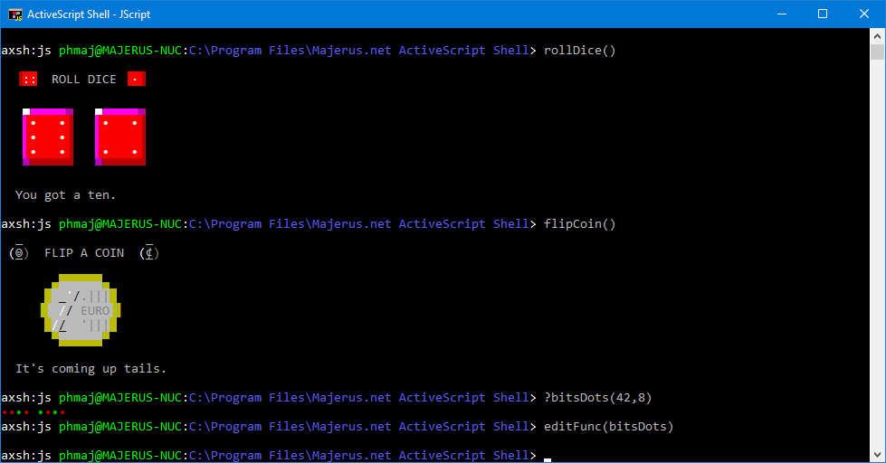

# AXSH.Library
Scripts, Functions, Modules and Script Components library for Majerus.net ActiveScript Shell (axsh)

ActiveScript Shell (axsh) is a Windows 10 command line shell using Active Scripting Engines. This repository is used to store extra or under development scripts, dynamically-loaded functions and modules, as well as Windows Script Components designed to extend AXSH.

These can be added to your environment simply by placing them in a %UserProfile%\Documents\Majerus.net ActiveScript Shell\ folder.
For example, Functions\ files should end up in C:\Users\Username\Documents\Majerus.net ActiveScript Shell\Functions\.

Current build of ActiveScript Shell is regularly posted in my public OneDrive folder: http://onedrive.phm.lu

Grab the `Majerus.net ActiveScript Shell *.msi` that matches your OS architecture.

To be able to release minor improvements somewhat regularly, I don't update the version number for the time being,
this means any previous version must be uninstalled before installing a new one, as Windows installer will otherwise see them as identical and won't update it.
I plan to return to proper version numbers once it gets updated less regularly and once the website is back.

- Philippe Majerus
